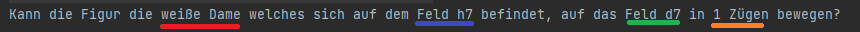

ChessTrainer:
Kurzbeschreibung:
Mit diesem Spiel soll eine Person seine visuellen über das Spiel [Schach](https://de.wikipedia.org/wiki/Schach) verbessern.
Die Figuren können sich so bewegen wie in dem normalen Schachspiel.  
Das Spiel wurde mit den Libaries [Processing(https://processing.org)] und der [ControlP5](https://www.sojamo.de/libraries/controlP5/) erstellt.
Bei diesem Spiel wird Ihnen eine Schachfigur auf ein Schachbrett gestellt und
ein weiteres Feld wird markiert. Sie sollen sagen, ob eine gegebene Figur  auf einem gegebenen Feld in den angegebenen Anzahl von Zügen auf das gegebene Feld auf einem Schachbrett bewegen kann.
.
Danach können Sie ihre Antwort eingeben und bekommen Sie einr Rückmeldung, ob Sie korrekt geantwortet haben.
Dies wird so lange wiederholt, bis der Timer, welche im Hintergrund läuft, auf 0 geht. Zuletzt wird ausgegeben, wie viele Fragen sie korrekt beantwortet haben.  

Mit jShell öffnen:
Um das Programm in der Jshell zu öffnen, müssen sie folgenden Befehl ausführen in der jShell:
`jshell –-class-path ./out/production/Pis_Chess` . 
Danach müssen Sie folgenden Befehl in der jShell ausführen: 
`import model.gamemodel` .

Nachdem Sie dies getan haben, können sie das Spiel folgendermaßen starten:
`GameModel model = new GameModel().newGame();`

Die Standardzeit der Stoppuhr sind 500 Sekunden, um diese Zeit zu ändern, können Sie zwischen den Klammern von newGame eine Sekundenanzahl eingeben.
Bsp: 
`GameModel model = new GameModel().newGame(200);`
 
Dieses Beispiel würde die Zeit auf 200 Sekunden herabgesetzt werden. 

Um das danach gestellte Problem zu beantworten können Sie model.answerTask() eingeben und zwischen den Klammern entweder true oder false eingeben.
Bei true, sind Sie der Meinung das die gestellte Nachricht möglich ist in der angegebenen Anzahl von Zügen. 

`model.answerTask()`
Mit JAR:
Falls sie den Code auszuführen müssen Sie sich die JRE herunterladen und die jar Datei in dem Ordner out/artifacts/Pis_Chess_jar/Pis_chess.jar ausführen

Dann öffnet sich die GUI und sie können es nun bedienen.
Dort haben Sie ein Spielfeld, eine Stoppuhr, die Anzahl der verfügbaren Züge und die Anzahl ihrer korrekten Antworten.

Sie können ein neues Spiel starten, indem Sie auf die Schaltfläche "Neues Spiel" klicken. Dannach erscheint auf dem Spielbrett eine Figur und ein Feld wird rot markiert. 
Sie müssen nun beantworten, ob die Figur es in der Anzahl der Züge auf das rot markiete Feld bewegen kann.  Dazu können sie auf die Schaltflächen
"Feld ist erreichbar" und "Feld ist nicht erreichbar" beantworten. Nachdem die Zeit abgelaufen ist können Sie erneut ein Spiel starten, indem Sie auf das Feld "Neues Spiel" klicken.

Quellen:
Pieces IMG Link: https://commons.wikimedia.org/wiki/Category:PNG_chess_pieces/Standard_transparent
P5 Control Documentation: https://sojamo.de/libraries/controlP5/reference/index.html
Threads: https://docs.oracle.com/javase/7/docs/api/java/lang/Thread.html
JUnit 5 Documentation: https://junit.org/junit5/docs/current/user-guide/

var model = model.GameModel.class
import model.*